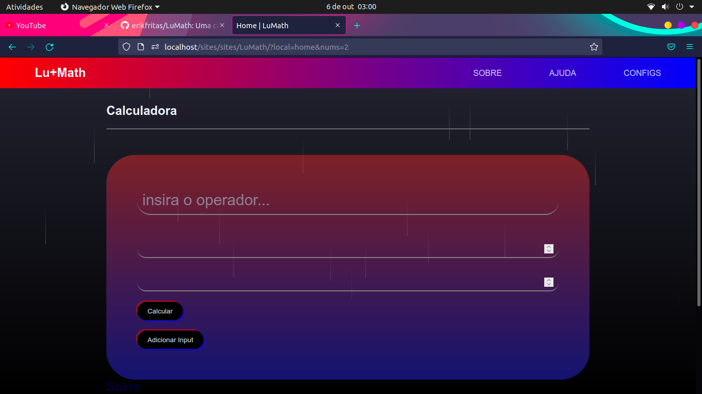

<header>
  <h1>LuMath</h1>
  
Uma calculadora feita em PHP, utilizando o padrão MVC

  
Antes de usar execute
     
    <kbd>
      composer install
    </kbd>
  

  

  <h3><strong>EM DESENVOLVIMENTO<strong></h3>
  
</header>

<footer>
  <h3>MADE BY: erikfritas</h3>
</footer>
